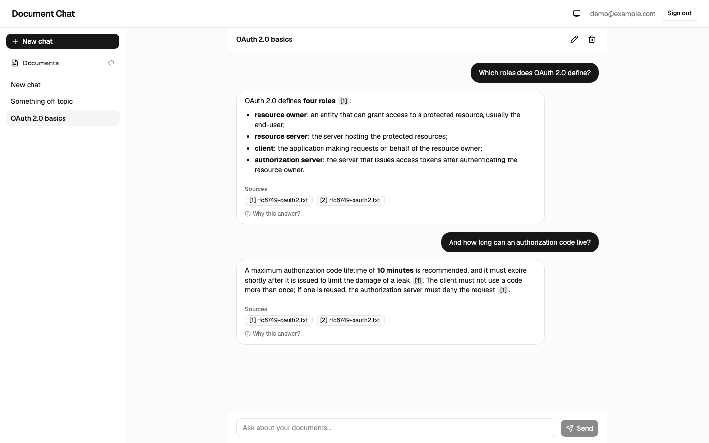
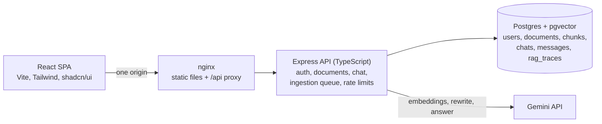
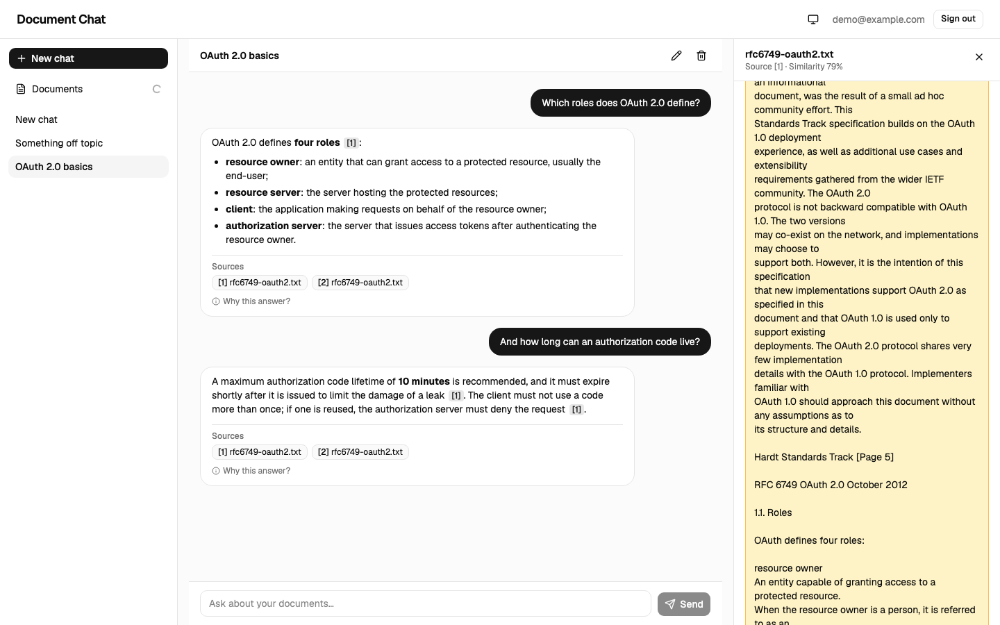
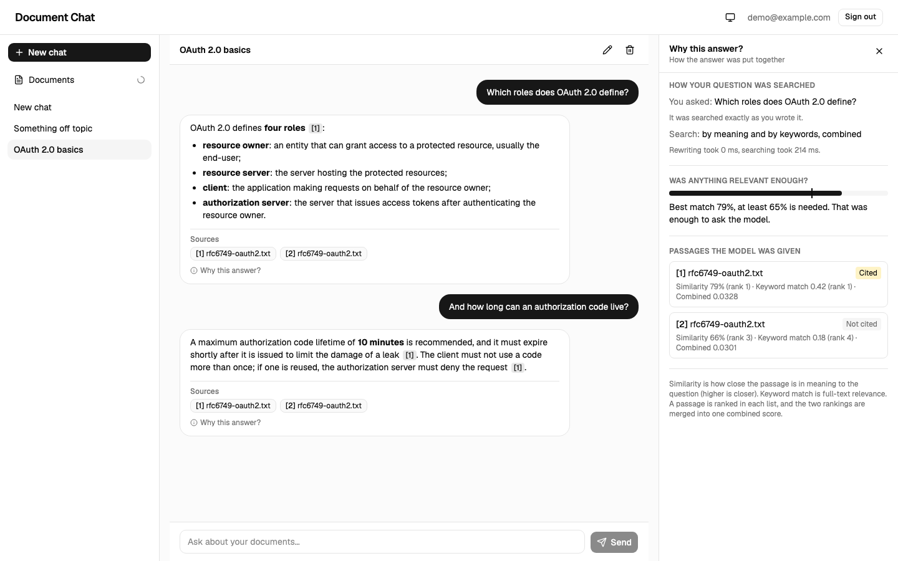
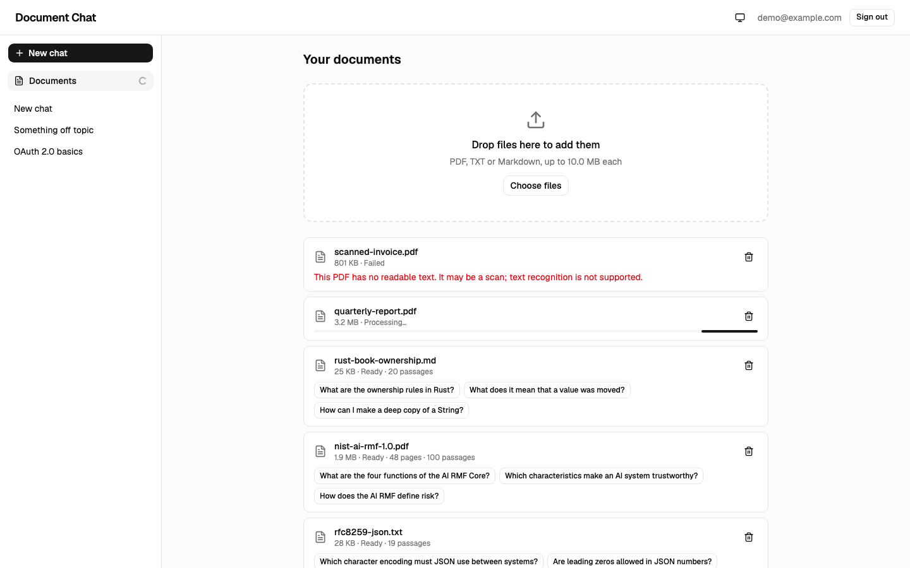
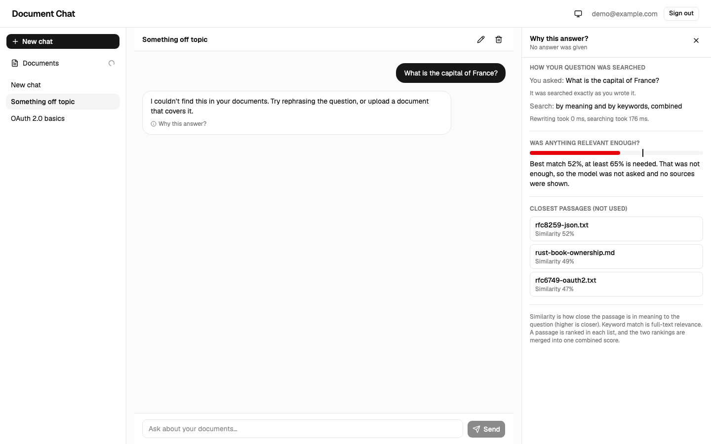
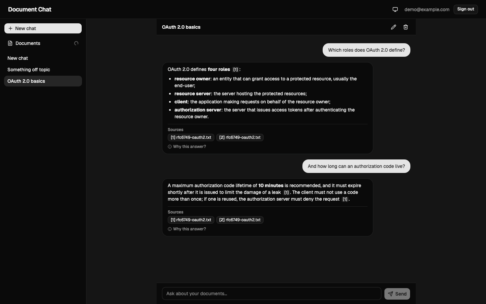
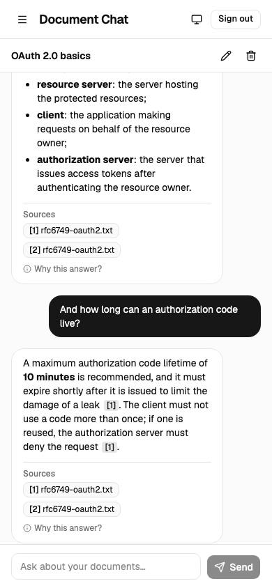

# Document Chat

A web app where you upload documents (PDF, TXT, Markdown) and ask questions about them. Answers are streamed, grounded in your documents, and cite the passages they came from. If the documents don't contain the answer, the app says so instead of guessing.

I treated it like a real first version: a simple stack, free tiers only, and most of the effort on what decides whether a RAG app can be trusted: retrieval quality, refusals, citations, prompt injection, quotas and observability.



<!-- Live demo: add the Render link here. -->

## Quick start

You need Docker and a free [Gemini API key](https://aistudio.google.com/apikey). Without a key the app starts, but indexing and chat report "not configured".

```bash
git clone https://github.com/dev-marian-vybyranyi/rag-document-chat.git
cd rag-document-chat
cp .env.example .env          # put your key into GOOGLE_GENERATIVE_AI_API_KEY
docker compose up --build     # open http://localhost:8080
```

Register, open **Documents**, drop in files from `samples/` (a NIST PDF, two RFCs, two Rust Book chapters), wait for **Ready**, then ask e.g. _"Which roles does OAuth 2.0 define?"_.

- Development: `npm install`, `docker compose up -d db`, `npm run dev` (web :5173, API :3000).
- Checks: `npm run lint && npm run typecheck && npm test && npm run build` (about 1,250 tests; none calls a real model).
- Quality evaluation, run by hand because it uses Gemini quota: `npm run eval:retrieval -w @rag-chat/api` and `npm run eval:faithfulness -w @rag-chat/api`.
- Deploy: `render.yaml` is a Render Blueprint (two free Docker services; the database is a free Neon Postgres, so `DATABASE_URL` is entered by hand). Create it from the dashboard, give it the model key (`GOOGLE_GENERATIVE_AI_API_KEY`, or `AI_PROVIDER=openai` with `OPENAI_API_KEY`) and set `API_UPSTREAM` to the API's public URL. Migrations run on API start; deploys wait for green CI.
- All settings are environment variables, documented in `.env.example`.

A step-by-step manual test checklist (in Ukrainian) is in [`docs/MANUAL.uk.md`](docs/MANUAL.uk.md).

## Architecture



- **One origin:** the browser only talks to nginx, which serves the build and proxies `/api/*`. No CORS, simple cookies, same layout locally, in Docker and on Render.
- **Indexing** (`POST /documents` returns `202`): extract text page by page, chunk (~400 tokens, 60 overlap), embed in paced batches, write chunks and mark the document ready in one transaction, then generate three suggested questions.
- **Answering:** rewrite follow-ups into a standalone query → vector + keyword search (this user's chunks only) → fuse with RRF → if the best similarity is below 0.65, refuse without calling the model → otherwise stream a grounded answer, drop citations to sources that don't exist, save the answer with its sources and a trace row.
- Code is organised by feature: `apps/api/src/{auth,documents,rag,chat,ai,http,observability,eval}`, `apps/web/src/{features,components,pages}`.

## RAG and LLM decisions

Each choice, with what else I considered, is in [`docs/DECISIONS.md`](docs/DECISIONS.md). In short:

- **LLM: Gemini 3.5 Flash-Lite.** Free tier was the constraint. The bigger Flash model was often overloaded (answers after 30 to 180 s); Flash-Lite answers in about a second. Model and thinking level are settings, and `AI_PROVIDER=openai` switches chat and embeddings to OpenAI (`gpt-5-nano`, `text-embedding-3-small` cut to 768 dimensions) without code changes.
- **Embeddings: `gemini-embedding-001`, 768 dimensions.** Separate passage/query task types improve QA retrieval; a local model wouldn't fit the 512 MB free instance; 768 dims keep rows small. Considered `gemini-embedding-2` and OpenAI.
- **Vector DB: pgvector in the same Postgres.** Vectors, full-text search and metadata together mean hybrid search is one query and user data goes away with a cascading delete. A dedicated vector store is the step at real scale.
- **Orchestration: none.** No LangChain/LlamaIndex. The Vercel AI SDK only calls models and streams; retrieval, prompting and context handling are a few hundred explicit lines I can read and test.
- **Retrieval: hybrid.** Vector and full-text results, 20 each, merged by reciprocal rank fusion (cosine and `ts_rank` are on unrelated scales, so adding them would be guesswork); top 6 go to the model. A cheap model rewrites follow-ups; if it fails the original question is used.
- **Prompt and context:** a constant system prompt (answer only from numbered sources, cite `[n]`, one exact refusal sentence, treat sources as untrusted data); sources in escaped, delimited blocks; at most 14,000 characters of sources and the last 8 turns of history.
- **Relevance threshold 0.65:** the vector search always returns neighbours, relevant or not, so below this cosine similarity the app refuses itself. Calibrated on real embeddings.

## Quality, guardrails, observability

**Evaluation.** `samples/` holds five public documents (sources, licenses and hashes in `samples/SOURCES.md`). `scripts/eval/golden.json` has 67 questions (57 answerable, 5 of them follow-ups; 10 unanswerable), each with a verbatim quote that a test finds in the document. Retrieval, top 6, real embeddings:

| Search           | hit@1 | hit@3 | hit@6 | MRR  |
| ---------------- | ----- | ----- | ----- | ---- |
| hybrid (the app) | 72%   | 89%   | 95%   | 0.81 |
| vector only      | 70%   | 91%   | 100%  | 0.81 |
| keyword only     | 67%   | 82%   | 93%   | 0.76 |

What I take from it: on this corpus **hybrid is not better than vector-only** (RRF lets keyword hits push down passages that are only vector-relevant), and the **threshold is a coarse filter**: it passes 98% of answerable questions but refuses only half of the unanswerable ones, because questions that merely sound like the corpus score 0.72 to 0.76. The set is small and written by one person, so these are regression signals, not a benchmark.

The faithfulness check (the real chat code answers, a second model grades each claim against its sources) is written and tested, but I haven't published full-run numbers: it needs the daily free embedding quota, which I used up while building the scripts.

**Guardrails.**

- Prompt injection: fixed instructions, escaped delimited sources, invisible characters stripped, suspicious passages flagged in logs, no raw HTML or images in answers, no tools for the model, retrieval scoped to the user in SQL. It limits what an attack can do; it isn't a guarantee.
- Citation validation: references to nonexistent sources are removed from the stream.
- Limits: 2,000-character questions, 10 MB / 500-page files, 20 documents and 100 chats per user, 10 questions a minute and 150 a day (keyed by user, since the client IP is unreliable behind Render's proxies).
- Gemini quotas: per-minute and daily 429s are told apart, the wait is shown, and the app stops calling the model for that time. Indexing is paced by tokens per minute (a large text sent in one request can never fit a 30,000-token minute).
- One JSON error shape with a request id; no internals leaked.

**Observability.** JSON logs with a request id from nginx through the API; a `rag_traces` row per question (query, retrieved passages with scores, timings, tokens, outcome, citations kept/removed); the "Why this answer?" panel shows the user the same data. Not built: metrics, dashboards, alerting, an LLM tracing UI.

## Key technical decisions

- Postgres for everything, including vectors and sessions.
- Server-side sessions (opaque token in an httpOnly cookie, hash in the DB), `scrypt` passwords from Node's standard library.
- Indexing inside the API process, one document at a time, behind a `202`. Simple and safe on 512 MB; a restart marks interrupted documents as failed.
- Sources and retrieval details saved with each answer, so deleting a document doesn't rewrite history and the "Why" panel needs no joins.
- Sources sent before the first token; errors in the stream are plain words from a fixed list, never provider text.

## Productionizing it (AWS; GCP, Azure, Cloudflare equivalents in brackets)

- **Web:** S3 + CloudFront instead of nginx; raise idle timeouts for streaming.
- **API:** stateless containers on ECS Fargate behind an ALB, at least 2 across 2 AZs, autoscaled [Cloud Run / Container Apps].
- **Database:** RDS or Aurora PostgreSQL with pgvector, Multi-AZ, backups, RDS Proxy; migrations as a release step, not on startup. Beyond millions of chunks: partition by tenant or move to OpenSearch / a vector store.
- **Indexing:** upload to S3, event to SQS, a separate worker with retries, a dead-letter queue and progress; fixes "a restart kills indexing".
- **Models:** a paid tier with real quotas and a data-processing agreement (free-tier Gemini may use prompts to improve Google's products); Vertex AI or Bedrock; version embeddings per chunk so the model can change; cache query embeddings.
- **Shared state:** Redis for rate limits and the provider cooldown, which are in memory today.
- **Security:** WAF, Secrets Manager, email verification and password reset, trace retention and delete-my-data.
- **Observability:** OpenTelemetry to CloudWatch/X-Ray, dashboards on latency, refusal rate, quota errors and token cost per tenant, the evaluation run nightly in CI.
- Cloudflare would be a bigger rewrite (Workers instead of Express, Vectorize or Postgres via Hyperdrive, R2, Queues); I'd choose it only if I started there.

## Engineering standards

**Followed:** strict TypeScript, ESLint and Prettier in CI, zod validation of every external input (HTTP, env, model output), feature-oriented modules, Conventional Commits in small steps with checks green, integration tests against a real Postgres with mocked models, hand-made mutation checks (break the code, confirm the right test fails), CI with a pgvector service and Docker builds, multi-stage images, secrets only in env vars, `npm audit` clean, basic accessibility (focus handling, labels, keyboard), decisions logged as I went.

**Skipped on purpose:** browser end-to-end tests and load tests; metrics and tracing; CSRF tokens (relying on `SameSite=Lax` and a JSON-only API); email verification and password reset; durable queue, OCR and original-file storage; persistent rate limits; pagination and trace retention; non-English documents; a coverage gate; a demo video.

## How I used AI tools

- `CLAUDE.md` holds the commands, conventions and a working agreement. The key rule: the assistant never runs `git commit`/`git push`; I read every change and commit it.
- A written plan cut into small commits, one logical change each, handed over one at a time, so every diff was small enough to actually review.
- `docs/DECISIONS.md` as the memory between sessions: what was considered, why, what it costs. This README is built from it.
- Tests as the contract, with mutation checks to prove they can fail. The assistant had to read current library docs instead of trusting memory, and real API calls happened only by hand.
- Do: small tasks with the reasoning attached, and claims checked against the real system. Don't: let it commit, accept "tests pass" as proof the tests are good, or let it decide the architecture.

Where it went wrong: while building the evaluation scripts it ran real evaluations several times and used up my daily free embedding quota; it wrote a test with a wrong assumption about how a validation library counts emoji; and its first fix for returning keyboard focus after closing a panel went to the wrong button, which a test caught. Reviewing is not optional.

## What I'd do with more time

1. Settle retrieval with data: a bigger golden set, then vector-weighted fusion and a reranker, keeping what the numbers support.
2. A durable indexing pipeline: original files in object storage, a queue and worker, resumable jobs, per-document progress.
3. Run the faithfulness evaluation regularly with a stronger judge, publish the numbers, and run it nightly in CI.
4. Better refusals for questions that sound like the corpus but aren't in it.
5. Real observability: OpenTelemetry, a dashboard over `rag_traces`, LLM tracing.
6. Choose which documents a question is about; OCR, tables and other languages.

Known limits of the demo: free services sleep after 15 minutes (first request can take a minute or two), free Neon storage is small, free Gemini quotas include a daily cap on embeddings, and greetings are refused like any off-topic message.

## Screenshots

Taken from the Docker Compose stack. The documents are the real ones from `samples/` indexed by the real pipeline, but the conversations and suggested questions were prepared by hand (the daily Gemini quota was used up), so the answers are not live model output.

|                                                         |                                                                   |
| ------------------------------------------------------- | ----------------------------------------------------------------- |
|  |        |
| Clicking a citation opens the passage in context        | "Why this answer?": search, relevance, passages, scores           |
|          |  |
| Library: ready, processing and failed documents         | A refusal with the closest passages that were set aside           |
|        |                     |
| Dark theme                                              | Phone width                                                       |
